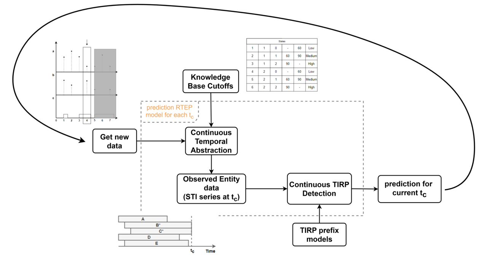
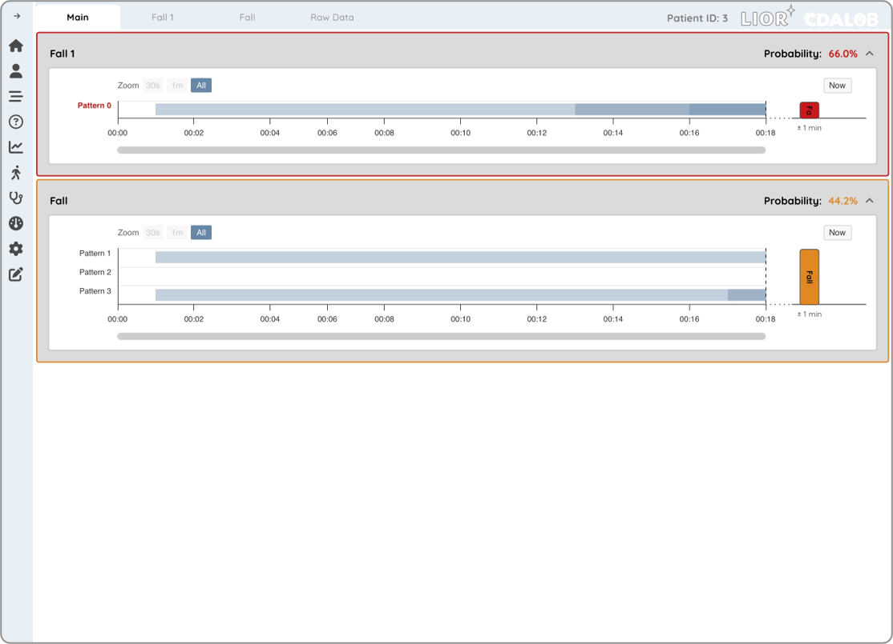
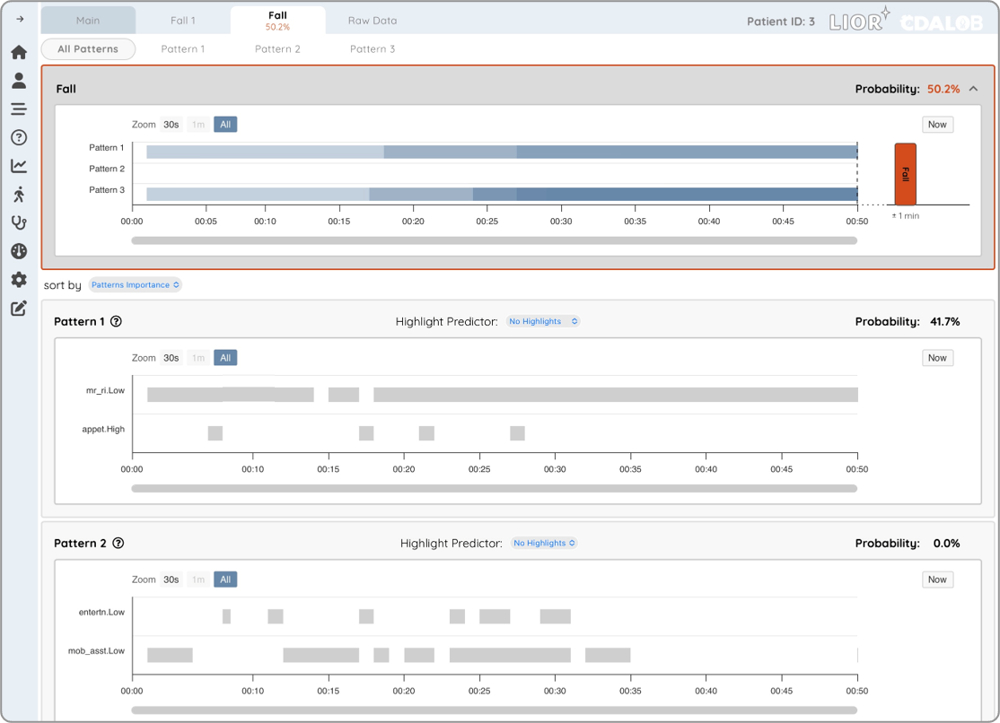
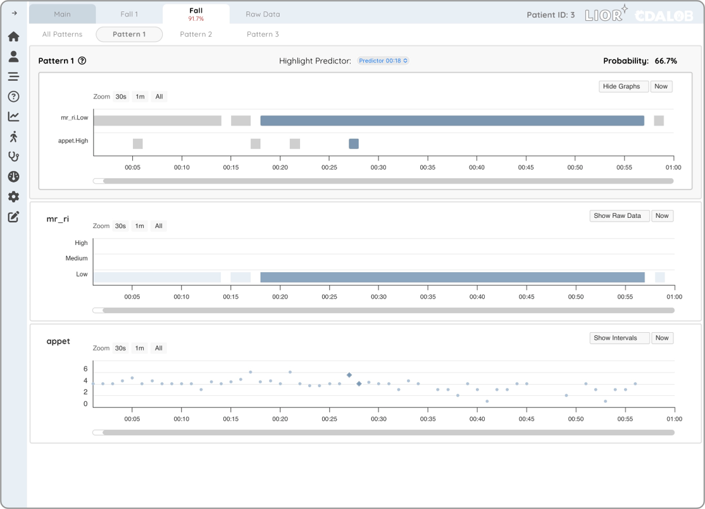

# Real-Time Clinical Event Prediction Platform

### M.Sc. Thesis Project | Ben-Gurion University | Complex Data Analytics Lab (CDALab)

A real-time machine learning platform for continuous prediction of clinical events in Intensive Care Unit (ICU) patients.

The project was developed as part of an M.Sc. thesis in Information Systems Engineering and focuses on transforming streaming clinical data into actionable predictions using temporal abstraction, temporal pattern mining (TIRPs), and probabilistic modeling.

The system provides clinicians with real-time risk estimation, pattern explainability, and interactive patient investigation capabilities.

---

# Motivation

Clinical deterioration events often develop gradually over time.

Traditional predictive models operate in batch mode and repeatedly analyze the entire patient history whenever new measurements arrive.

This project introduces a continuous prediction framework that incrementally updates patient representations and predictions as new data becomes available, enabling real-time clinical decision support.

---

# System Architecture

<p align="center">
  
</p>

The platform continuously processes incoming patient measurements through several stages:

1. Clinical Data Acquisition
2. Continuous Temporal Abstraction
3. Continuous TIRP Detection
4. Temporal Pattern Evaluation
5. Probabilistic Prediction
6. Interactive Visualization

The prediction process is updated at every timestamp without reprocessing the entire patient history.

---

# Main Dashboard

<p align="center">
  
</p>

The dashboard provides:

- Real-time event probabilities
- Temporal pattern monitoring
- Event timelines
- Patient-specific risk assessment
- Continuous prediction updates

The interface was designed to support clinical decision making while maintaining transparency regarding the patterns contributing to predictions.

---

# Pattern Exploration

<p align="center">
  
</p>

Users can explore:

- Detected temporal patterns (TIRPs)
- Pattern importance
- Pattern probabilities
- Pattern evolution over time

This functionality provides explainability and allows clinicians to understand the factors influencing predictions.

---

# Pattern Deep Dive

<p align="center">
  
</p>

The platform enables investigation of:

- Individual temporal patterns
- Underlying state intervals
- Raw measurements
- Temporal abstractions
- Predictor-specific contributions

This creates a direct connection between the machine learning model and the original patient data.

---

# Core Research Contributions

## Continuous Temporal Abstraction

Developed a real-time temporal abstraction mechanism that incrementally transforms streaming measurements into symbolic interval representations.

## Continuous TIRP Detection

Implemented continuous temporal pattern detection capable of updating discovered patterns as new observations arrive.

## Real-Time Event Prediction

Designed a prediction framework that continuously estimates event risk without requiring full historical recomputation.

## Clinical Decision Support

Integrated prediction results into an interactive dashboard for healthcare professionals.

---

# Technology Stack

## Backend

- Python
- Flask
- REST APIs
- Pandas
- NumPy

## Machine Learning & Analytics

- Probabilistic Modeling
- Temporal Pattern Mining (TIRPs)
- Time-Series Analysis
- Continuous Prediction
- Healthcare Analytics

## Frontend

- React
- JavaScript
- Interactive Data Visualization

---

# Repository Structure

```text
backend/
│
├── api/
├── services/
├── models/
├── prediction/
└── utilities/

frontend/
│
├── src/
├── components/
├── services/
└── assets/

docs/
│
└── images/

README.md
```

# Research Context

This project was developed as part of an M.Sc. thesis in Information Systems Engineering at Ben-Gurion University.

Research areas:

- Machine Learning
- Temporal Data Mining
- Healthcare Analytics
- Real-Time Prediction
- Clinical Decision Support Systems

---

# Future Directions

- Advanced uncertainty modeling
- Multi-event prediction
- Explainable AI enhancements
- Additional clinical datasets
- Large-scale deployment evaluation

---

# Author

**Ayelet Hashahar Cohen**

M.Sc. Student, Information Systems Engineering  
Ben-Gurion University of the Negev

Complex Data Analytics Lab (CDALab)
